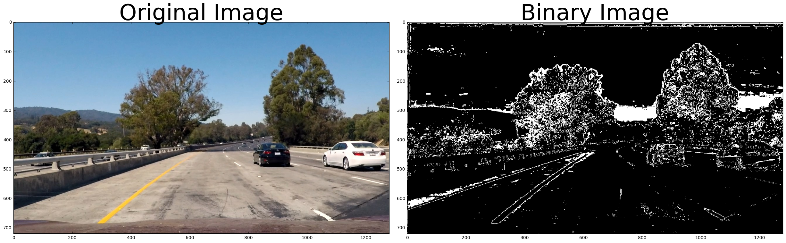
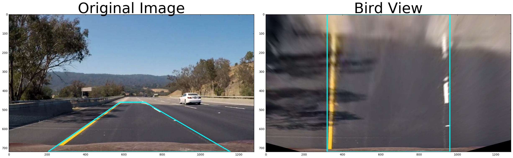

# Writeup

## Rubric Points

### Camera Calibration
#### 1. Have the camera matrix and distortion coefficients been computed correctly and checked on one of the calibration images as a test?

You can find the code I have used to calibrate the camera inside of the `calibrate_camera()` function of my [notebook](code.html). Three out of twenty pictures could not be used for calibration due to the fact that the chessboard is not fully visible in them.

I later use the results of the calibration to undistort the images as demonstrated in the notebook and below:


### Pipeline (single images)
#### 1. Has the distortion correction been correctly applied to each image?

This is the complete code of my pipeline:

```
def process_image(input_image):
    global mtx, dist, left_fit, right_fit, ploty, left_fitx, right_fitx, index
    
    undistorted = undistort_image(input_image, mtx, dist)
    binarized = apply_threshold(undistorted)
    bird_view, Minv = apply_transform(binarized)

    #Use sliding windows every 10 frames
    if index == 0:
        detected_lines, left_fit, right_fit, ploty, left_fitx, right_fitx = detect_lines_sliding_window(bird_view)
        index += 1
    else:
        detected_lines, left_fit, right_fit, ploty, left_fitx, right_fitx = detect_lines(bird_view, left_fit, right_fit) 
        if index == 10:
            index = 0

    with_lines = project_line(input_image, bird_view, left_fitx, right_fitx, ploty, Minv)
    return with_lines
```

As you can see, the 3rd line of the function is used to undistort the supplied image. I use `mtx` and `dist` variables to perform undistortion. These variables I receive by calibrating the camera. 

#### 2. Has a binary image been created using color transforms, gradients or other methods?

I receive the binary image by converting the image to the `HLS` color space, then separating and thresholding the `S` channel, and combining it with the Sobel output on the `X` scale. The complete code is available in the `apply_thresold` method of my [notebook](code.html).

I have developed a GUI application to find the optimal thresholds for my algorithm. The code could be found inside of the [Lane Finding GUI](lane_finding_gui.py) file.

Presentation of the GUI:


Example output:



#### 3. Has a perspective transform been applied to rectify the image?

I use OpenCV to transform the image to "birds-eye view". The code can be found in the `apply_transform` method of my [notebook](code.html). 

Example output:



#### 4. Have lane line pixels been identified in the rectified image and fit with a polynomial?

I have written two functions to detect the lane lines. They are `detect_lines_first_frame` and `detect_lines_follow_up_frame` and can be found in my [notebook](code.html).

Example output:


#### 5. Having identified the lane lines, has the radius of curvature of the road been estimated? And the position of the vehicle with respect to center in the lane?

Yes, I have created a method called `measure_curverad` which returns the curverad of the two lanes as well as the current position of the vehicle relative to the middle of the lane.

#### 6. Has the result from lane line detection been warped back to the original image space and displayed?

The code to do this can be found in my `project_line` function.

Example output:


### Pipeline (video)

#### 1. Does the pipeline established with the test images work to process the video?

You can find the video example of my pipeline output on YouTube:

[](https://www.youtube.com/watch?v=udPCURqjOdI)

The code is available in the [notebook](code.html).

#### 2. Has some kind of search method been implemented to discover the position of the lines in the first images in the video stream?

I use the picks of the histogram and the sliding windoes to reposition the lines every 10 frames. The code is available in the `detect_lines_first_frame` method of my [notebook](code.html).

#### 3. Has some form of tracking of the position of the lane lines been implemented?

Every frame of my `detect_lines_follow_up_frame` method returns the modified positions of the lines which I then use to locate the lines in the follow up frame.


### Readme

#### 1. Has a Readme file been included that describes in detail the steps taken to construct the pipeline, techniques used, areas where improvements could be made?

The overview of the project can be found in my [Readme](readme.md) file, the code can be found in my [Jupyter Notebook](code.html) and this file is used to discuss my work and the output.

The pipeline is working pretty well on the test images and the test video. It doesn't, however, handle well very bright light and shadows. To improve the results further I could look into tuning the parameters of binarization of the images and apply some path to make sure that the lines are approximately parallel, have a reasonable distance from each other and curve in a similar way.